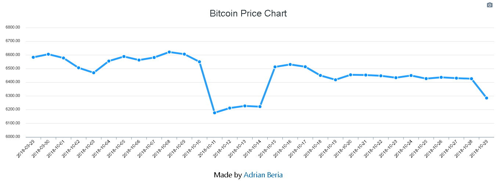

# BITCOIN APP CHART

> Run your client with a single command

## Quick Start

``` bash
# Install dependencies for client
yarn install

# Run your app
yarn start

# Client on http://localhost:3000
```

## Folder Distribution

The workflow I currently use is as follows:

- public
    - index.html 
- src
    - components
        ContainerChart.js
    - App.js

## What is this app about

We're creating an application that shows the price of Bitcoin during the last month until today using the Coindesk API.




Check it live [here](http://radinax.github.io/React-Bitcoin-Chart).

We make use of Create-React-App for a quick setup, then we install **Apex Charts** which is great library for displaying data through different types of Charts and is compatible with React JS. 

The structure of the Library looks like this:

```
 options: {
              chart: {
                  //background: '#f4f4f4',
              foreColor: '#333'
              },
              xaxis: {
                  categories: []
              },
              fill: {
                  colors: ['#f44336']
              },
              dateLabels: {
                  enabled: false
              },
              title: {
                  text: 'Bitcoin Price Chart',
                  align: 'center',
                  margin: 20,
                  offsetY: 20,
                  style: {
                      fontSize: '25px'
                  }
              }
            },
            series: [{
                name: 'Numbers',
		            data: []
            }]
        }
```

The two important parts of this structure are **categories** where the data related to the X axis is going to be at, and **data** which is an empty array for now as well as categories which is where the Bitcoin price is going to be located.

We make use the React Life Cycle Method **componentDidMount** to fetch the data from the Coindesk API.

```
componentDidMount() {
        fetch("https://api.coindesk.com/v1/bpi/historical/close.json")
            .then(response => response.json())
            .then(data => this.setState({
                options: {
                    ...this.state.options,
                    xaxis: {
                        categories: Object.keys(data.bpi)
                    }
                },
                series: [{
                    name: 'Price',
                    data: Object.values(data.bpi)
                }] 
            }));
      }
```
Finally we make use of the **Chart** component from **react-apexcharts**:

```
<Chart 
    options = {this.state.options}
    series = {this.state.series}
    type="line"
    height= "450"
    width= "100%"
/>
```
## Closure

This app shows the price of Bitcoin prices and shows a comparative to other days prices. React JS is a great tool for web applications, in this case it was very simple by using [Apex Charts](https://apexcharts.com/), compared to other libraries like VX or Victory which are based on D3.

**Made by Adrian Beria.**

**Web Developer.**